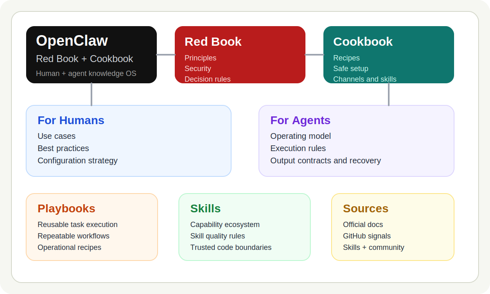
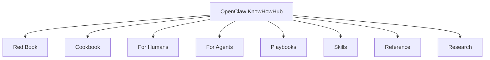

# OpenClaw KnowHowHub

The Red Book and Cookbook for OpenClaw.

Website: <https://jimmywangjimmy.github.io/OpenClaw-KnowHowHub/>

> OpenClaw 不是一个只靠零散链接就能学明白的系统。
> 这个仓库的目标，是让你先建立判断力，再获得可直接复用的做法。

## Start Here

| You are... | Start here | Then open |
| --- | --- | --- |
| 第一次接触 OpenClaw 的人 | [Red Book](red-book/README.md) | [Cookbook](cookbook/README.md) |
| 想尽快把事情做成的人 | [Cookbook](cookbook/README.md) | [Top 10 For Humans](reference/top-10-for-humans.md) |
| 想写 rules、skills、playbooks 的人 | [Top 10 For Agents](reference/top-10-for-agents.md) | [For Agents](for-agents/README.md) |

## Why People Stay

| What you get | Why it matters |
| --- | --- |
| 一本 Red Book | 帮你建立 OpenClaw 的原则、边界和判断标准 |
| 一本 Cookbook | 帮你把常见任务直接做成，而不是从零摸索 |
| 一组高信号榜单 | 帮你少看低质量来源，先看最值得看的站点 |
| humans + agents 双入口 | 既方便人理解，也方便 agent 读取和复用 |

## A Book, Not A Bookmark Dump

| Red Book | Cookbook |
| --- | --- |
| 讲原则 | 讲步骤 |
| 讲边界 | 讲配方 |
| 讲判断标准 | 讲默认顺序 |
| 适合先建立心智模型 | 适合立刻动手 |

## What This Repo Is

这不是普通资料库，也不是零散链接收藏夹。

这是一个同时服务两类读者的 OpenClaw 必读入口：

- `Red Book`: 讲原则、方法论、边界和判断标准
- `Cookbook`: 讲步骤、配方、模板和实战入口

## Who This Is For

- 第一次接触 OpenClaw，但不想在一堆零散来源里迷路的人
- 已经在用 OpenClaw，但希望更安全、更系统的人
- 想给 OpenClaw 写 skills、playbooks、规则和长期工作流的人
- 想让 agent 直接读取高信号知识的人

## Read This First

| If you want... | Open this |
| --- | --- |
| 理解 OpenClaw 是什么 | [Red Book](red-book/README.md) |
| 直接开始动手 | [Cookbook](cookbook/README.md) |
| 找最值得先看的网站 | [Top 10 For Humans](reference/top-10-for-humans.md) |
| 给 OpenClaw agent 一组高信号来源 | [Top 10 For Agents](reference/top-10-for-agents.md) |

## The Two Books

### Red Book

给所有 OpenClaw serious 用户看的方法论层。

> 适合先读：
> 当你还在问“应该怎么想、怎么配、哪里最危险”。

- [What Is OpenClaw](red-book/what-is-openclaw.md)
- [Best Practices](red-book/best-practices.md)
- [Security First](red-book/security-first.md)
- [How To Think About Configuration](red-book/configuration.md)
- [How To Choose APIs And Models](red-book/api-selection.md)
- [Interaction Patterns](red-book/interaction-patterns.md)

### Cookbook

给“我要现在做成一件事”的读者看的实战层。

> 适合先查：
> 当你已经知道方向，只想把事情做成。

- [Quick Start Recipe](cookbook/quick-start.md)
- [Safe Setup Recipe](cookbook/safe-setup.md)
- [Channel Setup Recipe](cookbook/channel-setup.md)
- [Skill Installation Recipe](cookbook/skill-installation.md)
- [Build Your First Playbook](cookbook/first-playbook.md)

## At A Glance

## Best External Sources

| Source | Why it matters |
| --- | --- |
| [OpenClaw Docs](https://docs.openclaw.ai/) | 官方一手资料 |
| [OpenClaw GitHub](https://github.com/openclaw/openclaw) | 源码、issues、releases、真实维护信号 |
| [OpenClaw Skills](https://openclawskills.io/) | 技能生态入口 |
| [Moltbook](https://www.moltbook.com/) | agent-native 社区与技能分发入口 |
| [r/openclaw](https://www.reddit.com/r/openclaw/) | 高互动经验与摩擦反馈 |
| [Cross-Ecosystem References](reference/cross-ecosystem-references.md) | OpenAI / Anthropic 官方资料与高星仓库对照入口 |

## Why This Stays Useful

- 它先给你方法论，再给你配方
- 它优先收录 OpenClaw 官方与高信号来源
- 它既适合人读，也适合 agent 读取和复用

## If You Only Open 3 Pages

1. [Red Book](red-book/README.md)
2. [Cookbook](cookbook/README.md)
3. [Top 10 For Humans](reference/top-10-for-humans.md)

## Deeper Layers

- [For Humans](for-humans/README.md)
- [For Agents](for-agents/README.md)
- [Playbooks](playbooks/README.md)
- [Skills](skills/README.md)
- [Reference](reference/README.md)
- [Research](research/README.md)
- [Content Map](docs/content-map.md)

## Contribute

如果你希望这个仓库成为每个 OpenClaw 持有者必读的红宝书和 cookbook，欢迎：

- Star 这个仓库
- 提交更好的来源和修正
- 补充高质量 recipes、playbooks、skills 和案例

开始前请看 [CONTRIBUTING.md](CONTRIBUTING.md)。
