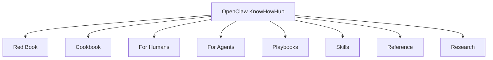

# OpenClaw KnowHowHub

The Red Book and Cookbook for OpenClaw.

> 如果你只想知道一件事：
> 先读 Red Book，做事时再查 Cookbook。

## What This Repo Is

这不是普通资料库，也不是零散链接收藏夹。

这是一个同时服务两类读者的 OpenClaw 必读入口：

- `Red Book`: 讲原则、方法论、边界和判断标准
- `Cookbook`: 讲步骤、配方、模板和实战入口

## Read This First

| If you want... | Open this |
| --- | --- |
| 理解 OpenClaw 是什么 | [Red Book](red-book/README.md) |
| 直接开始动手 | [Cookbook](cookbook/README.md) |
| 找最值得先看的网站 | [Top 10 For Humans](reference/top-10-for-humans.md) |
| 给 OpenClaw agent 一组高信号来源 | [Top 10 For Agents](reference/top-10-for-agents.md) |

## The Two Books

### Red Book

给所有 OpenClaw serious 用户看的方法论层。

- [What Is OpenClaw](red-book/what-is-openclaw.md)
- [Best Practices](red-book/best-practices.md)
- [Security First](red-book/security-first.md)
- [How To Think About Configuration](red-book/configuration.md)
- [How To Choose APIs And Models](red-book/api-selection.md)
- [Interaction Patterns](red-book/interaction-patterns.md)

### Cookbook

给“我要现在做成一件事”的读者看的实战层。

- [Quick Start Recipe](cookbook/quick-start.md)
- [Safe Setup Recipe](cookbook/safe-setup.md)
- [Channel Setup Recipe](cookbook/channel-setup.md)
- [Skill Installation Recipe](cookbook/skill-installation.md)
- [Build Your First Playbook](cookbook/first-playbook.md)

## At A Glance

## Best External Sources

- [OpenClaw Docs](https://docs.openclaw.ai/)
- [OpenClaw GitHub](https://github.com/openclaw/openclaw)
- [OpenClaw Skills](https://openclawskills.io/)
- [Moltbook](https://www.moltbook.com/)
- [r/openclaw](https://www.reddit.com/r/openclaw/)

## Why This Stays Useful

- 它先给你方法论，再给你配方
- 它优先收录 OpenClaw 官方与高信号来源
- 它既适合人读，也适合 agent 读取和复用

## Deeper Layers

- [For Humans](for-humans/README.md)
- [For Agents](for-agents/README.md)
- [Playbooks](playbooks/README.md)
- [Skills](skills/README.md)
- [Reference](reference/README.md)
- [Research](research/README.md)
- [Content Map](docs/content-map.md)

## Contribute

如果你希望这个仓库成为每个 OpenClaw 持有者必读的红宝书和 cookbook，欢迎：

- Star 这个仓库
- 提交更好的来源和修正
- 补充高质量 recipes、playbooks、skills 和案例

开始前请看 [CONTRIBUTING.md](CONTRIBUTING.md)。
