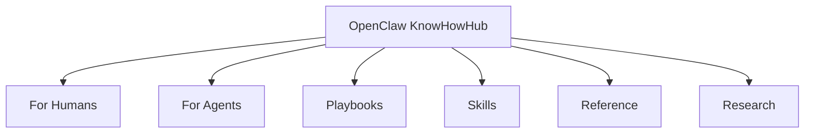

# OpenClaw KnowHowHub

OpenClaw 的 human + agent knowledge OS。

给人类看，它回答：
- OpenClaw 是什么
- 怎么安全使用
- 哪些网站最值得先看

给 OpenClaw agent 看，它提供：
- 可执行规则
- 输出契约
- playbooks
- skills 生态入口

## Why This Repo

- 把分散的 OpenClaw 官方资料、社区经验和技能生态收拢成一个入口
- 让新人更快看懂，让老手更快找到高价值来源
- 让 human 和 agent 都能读取同一套知识系统

## Start Here

| If you are... | Open this first | Then go here |
| --- | --- | --- |
| Human user | [For Humans](for-humans/README.md) | [Top 10 For Humans](reference/top-10-for-humans.md) |
| OpenClaw agent | [For Agents](for-agents/README.md) | [Top 10 For Agents](reference/top-10-for-agents.md) |
| Builder / operator | [Playbooks](playbooks/README.md) | [Skills](skills/README.md) |
| Researcher | [Source Landscape](reference/source-landscape.md) | [Source Intelligence](research/source-intelligence.md) |

## Pinned Rankings

### Humans

- [Top 10 For Humans](reference/top-10-for-humans.md)
- [Best Practices](for-humans/best-practices.md)
- [Configuration Strategy](for-humans/configuration-strategy.md)

### Agents

- [Top 10 For Agents](reference/top-10-for-agents.md)
- [Execution Rules](for-agents/execution-rules.md)
- [Output Contracts](for-agents/output-contracts.md)

## What You Can Explore

### For Humans

- [Use Cases](for-humans/use-cases.md)
- [Best Practices](for-humans/best-practices.md)
- [Configuration Strategy](for-humans/configuration-strategy.md)
- [Interaction Patterns](for-humans/interaction-patterns.md)
- [API Selection](for-humans/api-selection.md)

### For Agents

- [Operating Model](for-agents/operating-model.md)
- [Execution Rules](for-agents/execution-rules.md)
- [Output Contracts](for-agents/output-contracts.md)
- [Failure Recovery](for-agents/failure-recovery.md)
- [Evolution Inputs](for-agents/evolution-inputs.md)

### Knowledge Layers

- [Playbooks](playbooks/README.md)
- [Skills](skills/README.md)
- [Reference](reference/README.md)
- [Research](research/README.md)
- [Content Map](docs/content-map.md)

## Best External Sources

- [OpenClaw Docs](https://docs.openclaw.ai/)
- [OpenClaw GitHub](https://github.com/openclaw/openclaw)
- [OpenClaw Skills](https://openclawskills.io/)
- [Moltbook](https://www.moltbook.com/)
- [r/openclaw](https://www.reddit.com/r/openclaw/)

## Why Stay

- 快速找到最值得看的站点，而不是自己到处搜
- 理解 OpenClaw 的安全边界、部署路线和技能生态
- 看到的是经过筛选的高信号来源，不是杂乱书签

## Contribute

如果这个仓库帮你更快看懂 OpenClaw，欢迎：

- Star 这个仓库
- 提交更好的来源和修正
- 补充高质量 playbook、skills、案例和规则

开始前请看 [CONTRIBUTING.md](CONTRIBUTING.md)。
